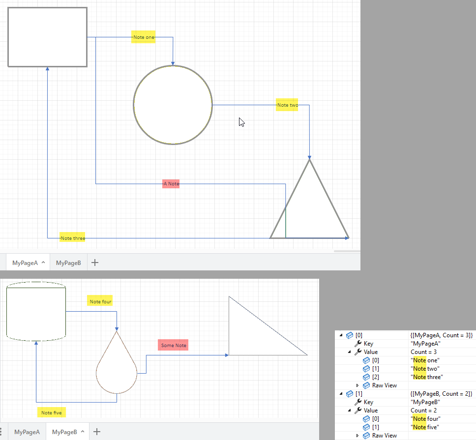

# VisioHelper
A project for reading and manipulating Visio diagram files using `System.IO.Packaging` and `System.Xml`.

The work is based on the documentation from Microsoft:

https://learn.microsoft.com/en-us/office/client-developer/visio/how-to-manipulate-the-visio-file-format-programmatically

As an idea for automation for my _personal needs_, was that I needed to find all the items that begin with a certain prefix, for this example, I used to find the ones that have "Note" prefix:

As a result, I get a collection of 2 pages with the list of all of the shapes that have the "Note" prefix.
